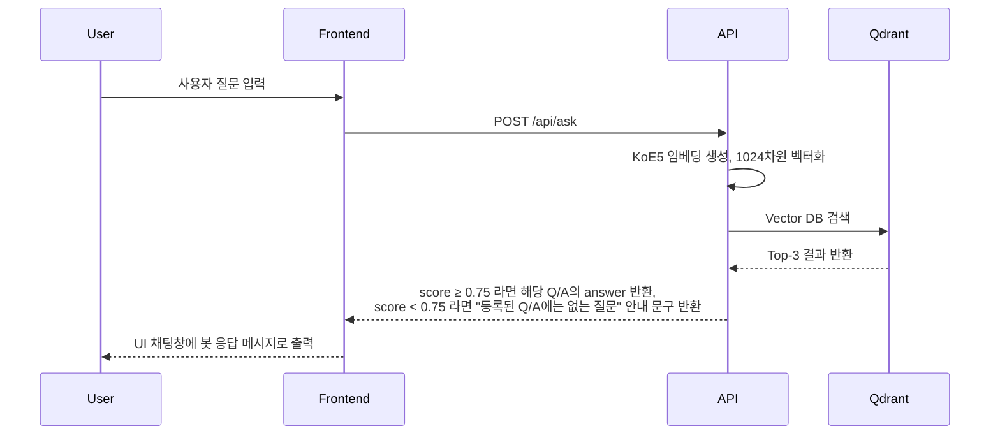

## 🤖 Perso FAQ Chatbot

> Perso.ai / 이스트소프트 관련 FAQ를 답변하는 지식 기반 챗봇입니다. <br>
> 한국어 특화 임베딩(KoE5) + 벡터DB(Qdrant)를 사용해 도메인 외부 질문은 막고, <br>
> 등록된 FAQ에 대해서만 안정적으로 매칭하여 답변합니다.


<br>

## 📦 Stacks

| 구분 | 기술 스택 |
|------|-----------|
| **Frontend** | Next.js (App Router) |
| | React |
| | TypeScript |
| | Tailwind CSS |
| **Backend** | Next.js (API Routes) |
| | Node.js️
| | Qdrant Cloud | 
| | HuggingFace API (KoE5) |
| **DevOps** | Vercel |

<br>

## 🔗 동작 흐름



<br>

##  🛠️ 임베딩 방식 및 벡터 DB

### 1. 임베딩(Embedding) 방식
> 문장 간 의미적 유사도를 비교할 수 있도록 자연어를 벡터로 바꿔주는 과정

- 사용 모델: `KoE5` (nlpai-lab/KoE5) <br>
- `HuggingFace Inference API`를 통해 호출 <br>
- 입력: 자연어 질문(Q) <br>
- 출력: 1024차원 벡터(float 배열) <br>

### 2. 벡터 DB

- **저장 구조**
   ```javascript
   {
  "id": 1,
  "vector": [0.123, -0.044, ...], //1024차원 KoE5 벡터
  "payload": {
    "question": "Perso.ai는 어떤 서비스인가요?",
    "answer": "Perso.ai는 ...",
    "source": "Q&A.xlsx"
     }
   }
   ```
- **검색 프로세스**

   - Qdrant에 벡터 검색 요청이 들어오면, 코사인 유사도가 가장 높은 항목 반환

- **임계값 필터링: `score_threshold`를 0.75로 설정**

   - 유사도가 임계값보다 낮으면 “도메인 밖 질문”으로 판단
   - 허위 응답 방지(Hallucination) 방지를 위해 도입

<br>

## 📈 정확도 향상 전략: 임베딩 모델 변경

- 초기에는 Google Gemini의 `text-embedding-004` 모델을 사용하였음
- 하지만, 도메인 밖 질의(ex. “고양이가 커피 마시면 어떻게 돼?")에 대해서도 <br> 도메인 내부 질의(ex. “이스트소프트는 어떤 회사인가요?”)와 거의 동일한 유사도(≈0.98)를 반환
- 이를 해결하기 위해, 한국어 검색 특화 임베딩 모델인 `KoE5(nlpai-lab/KoE5)`를 도입하여 간단한 도메인 벤치마크를 수행하였다.
  - 이때 `POS(도메인 내부)`와 `NEG(도메인 외부)` 쌍을 비교하여 “의미적으로 가까운 문장과 먼 문장을 얼마나 잘 구분하는지”를 측정하였다.

<br>

### 1. 개별 비교 표 (Gemini text-embedding-004 vs KoE5)
    
| 타입 | 사례 이름 | 문장 A | 문장 B | Gemini cosine | KoE5 cosine |
| --- | --- | --- | --- | --- | --- |
| POS | Perso 서비스 소개 | Perso.ai는 어떤 서비스인가요? | Perso.ai가 어떤 서비스인지 설명해줘. | 0.9849 | 0.9869 |
| POS | Perso 요금제 | Perso.ai의 요금제는 어떻게 구성되어 있나요? | Perso.ai 요금제 종류 알려줘. | 0.9820 | 0.9633 |
| POS | 이스트소프트 회사 소개 | 이스트소프트는 어떤 회사인가요? | 이스트소프트 회사에 대해 소개해줘. | 0.9305 | 0.9781 |
| NEG | 고양이 vs 이스트소프트 | 고양이가 커피 마시면 어떻게 돼? | 이스트소프트는 어떤 회사인가요? | 0.9849 | 0.4675 |
| NEG | 땅콩버터 vs 요금제 | 땅콩버터 레시피 알려줘. | Perso.ai의 요금제는 어떻게 구성되어 있나요? | 0.5973 | 0.4344 |
| NEG | 라면 vs Perso 서비스 | 라면 맛있게 끓이는 방법 알려줘. | Perso.ai는 어떤 서비스인가요? | 0.5859 | 0.4569 |


<br>

### 2. 평균 코사인 유사도 비교
    
| 구분 | Gemini text-embedding-004 | KoE5 (nlpai-lab/KoE5) |
| --- | --- | --- |
| 도메인 내부 질의(POS) 평균 | 0.9658 | 0.9761 |
| 도메인 외부 질의(NEG) 평균 | 0.7227 | 0.4529 |

<br>

### 3. 분석 결과

**도메인 내부 질의(POS)**

- Gemini와 KoE5가 모두 높은 유사도(각각 평균 0.9658, 0.9761)를 보였다.

**도메인 외부 질의(NEG)**

- Gemini
   - 평균 0.7227로 여전히 높은 유사도를 반환
   - 특히 FAQ와 전혀 관련 없는 문장도 0.98까지 표출됨

- KoE5
   - 0.45 수준의 낮은 유사도로 “도메인 밖 질문”을 명확히 구분
   - FAQ 챗봇에서 기대하는 동작에 가장 부합함

- 따라서 KoE5는 **도메인 내/외부 질의 모두 확실하게 구분하는 특성**을 보여,최종 임베딩 모델로 KoE5를 채택하였다.
